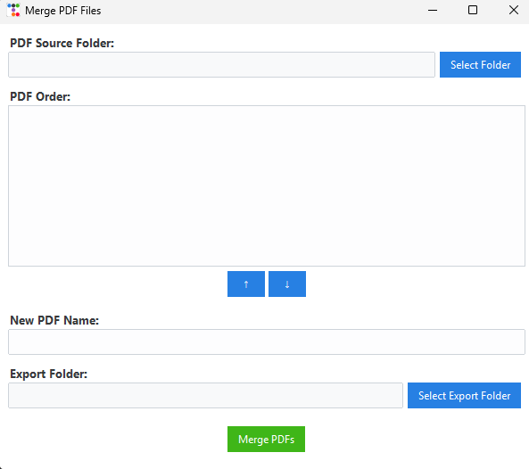

# PDF Merger

**PDF Merger** is a simple and modern desktop application that lets you merge multiple PDF files using a clean graphical interface.

You can select a folder containing PDF files, reorder them (default order is from oldest to newest by creation date), set the output file name, and choose where to export the final merged PDF.

## 🖥️ Features

- Select a folder of PDFs
- Automatically sorts by creation date (oldest to newest)
- Manually reorder files with up/down buttons
- Set a custom output PDF name
- Choose export location via file picker
- Prevents invalid Windows file names (e.g., `COM1`, `AUX`, `?`, `/`, etc.)
- Clean and modern interface with [ttkbootstrap](https://ttkbootstrap.readthedocs.io/)
- Built with Python and PyPDF2

## 📦 How to Use

### 🐍 If you have Python installed:

1. Clone this repo or download the source code
2. Install required libraries:
   ```bash
   pip install ttkbootstrap PyPDF2
   ```
3. Run the app:
   ```bash
   python3 main.py
   ```

### 🪟 If you **don't have Python installed**:

You can download the **Windows `.exe` version** from the [Releases](https://github.com/gabrieldemiri/pdf-merger/releases) section on GitHub and run it directly. No installation required.

## 📷 Screenshots



## 🛠 Built With

- [Python](https://www.python.org/)
- [tkinter](https://docs.python.org/3/library/tkinter.html)
- [ttkbootstrap](https://github.com/israel-dryer/ttkbootstrap)
- [PyPDF2](https://pypi.org/project/PyPDF2/)


